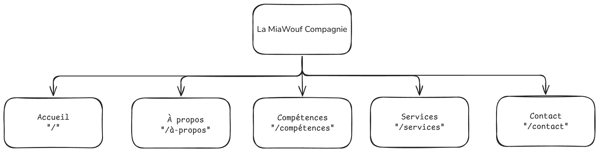

# Cahier des charges — Site vitrine "La MiaWouf Compagnie"

## 1. Présentation du projet

### 1.1 Contexte
La MiaWouf Compagnie est une activité de pet-sitting (garde et promenade d'animaux de compagnie) basée à Villoncourt (88) et ses alentours. Le site a pour but de présenter les services proposés, rassurer les futurs clients sur le sérieux de la prestation et faciliter la prise de contact / demande de devis.

### 1.2 Objectifs du site
- Présenter clairement l'offre de services (garde à domicile, promenade, visites & NAC).
- Rassurer les prospects : certification, engagements, déroulé d'une prestation.
- Générer des demandes de contact / devis (téléphone, email, formulaire, réseaux sociaux).
- Donner une image professionnelle et chaleureuse, cohérente avec l'univers animalier.
- Être consultable facilement depuis un mobile (recherche "pet-sitter près de chez moi").

### 1.3 Cible / public visé
- Propriétaires de chiens, chats et NAC (nouveaux animaux de compagnie) du secteur de Villoncourt (88) et alentours.
- Personnes recherchant une garde ponctuelle (vacances, déplacements) ou récurrente (promenades).
- Recherche principalement effectuée depuis un smartphone.

---

## 2. Présentation de l'activité

| Élément | Détail |
|---|---|
| Nom | La MiaWouf Compagnie |
| Activité | Garde et promenade d'animaux à domicile, pet-sitting |
| Zone d'intervention | Villoncourt (88) et alentours |
| Téléphone | 06 37 94 90 46 |
| Email | lamiawoufcompagnie@gmail.com |
| Facebook | facebook.com/LaMiaWoufcompagnie |
| Certification | Certificat de capacité pour animaux domestiques |

---

## 3. Arborescence du site

### 3.1 Page Accueil
- Hero (accroche + call-to-action vers contact/services)
- Section "À propos" courte (photo + texte de présentation + lien "En savoir plus")
- Section "Services" (aperçu des services principaux avec lien vers le détail)
- Section "Inclus gratuitement" (courrier, plantes, volets)
- Section "Contact" (coordonnées + boutons de réservation/appel)

### 3.2 Page Services
- Intitulé et description de chaque service
- Détail des prestations incluses (features) par service
- Section "Comment ça marche" (étapes : prise de contact, rencontre, garde, nouvelles)
- Grille tarifaire / section devis

### 3.3 Page À propos
- Présentation personnelle (parcours, motivation, certification)
- Section "Engagements" (ce sur quoi le client peut compter)
- Photo(s) illustrant l'activité

### 3.4 Page Contact
- Coordonnées complètes (téléphone, email, secteur, Facebook)
- Formulaire de contact / demande de devis
- Boutons d'action rapide (appeler, envoyer un email)

---

## 4. Fonctionnalités attendues

- [x] Navigation responsive (menu mobile + desktop)
- [x] Présentation des services avec détails (features, tarifs, pictos)
- [x] Mise en avant des services gratuits inclus
- [x] Étapes de déroulement d'une prestation
- [ ] Formulaire de contact fonctionnel (envoi réel des demandes — à raccorder à un service d'envoi d'email)
- [ ] Lien direct d'appel téléphonique et d'email (`tel:`, `mailto:`) — présents, à vérifier sur mobile
- [ ] Lien vers la page Facebook
- [ ] Mentions légales / politique de confidentialité (obligatoire, RGPD)
- [ ] Favicon / identité visuelle onglet navigateur
- [ ] Référencement naturel (SEO) de base (titres, meta description, balises alt des images)

---

## 5. Identité visuelle

| Élément | Statut |
|---|---|
| Logo | À fournir / valider avec le client |
| Palette de couleurs | Bordeaux, rose/blush, ivoire, blanc (déjà en place dans le code) |
| Typographies | À confirmer |
| Photos | Photos personnelles du client à intégrer (actuellement placeholders sur certaines sections, ex. `AboutPage`) |
| Ton rédactionnel | Chaleureux, rassurant, professionnel |

---

## 6. Contraintes techniques

- **Stack** : React 19 + TypeScript, Vite, React Router 7
- **Compatibilité** : dernières versions de Chrome, Firefox, Safari, Edge (desktop et mobile)
- **Responsive** : mobile-first, breakpoints à 768px et 1024px
- **Performance** : images optimisées, chargement rapide sur mobile/4G
- **Accessibilité** : contrastes suffisants, textes alternatifs sur les images, navigation au clavier

---

## 7. Hébergement et nom de domaine

| Élément | Statut |
|---|---|
| Nom de domaine | À définir avec le client (ex. lamiawoufcompagnie.fr) |
| Hébergement | À définir (ex. Netlify, Vercel, OVH...) |
| Certificat HTTPS | Requis |
| Adresse email professionnelle | À définir (actuellement Gmail) |

---

## 8. Légal / RGPD

- Mentions légales (identité de l'entreprise/auto-entrepreneur, hébergeur, directeur de publication)
- Politique de confidentialité si le formulaire de contact collecte des données personnelles
- Consentement / information sur l'utilisation des données du formulaire de contact

---

## 9. Livrables

- Site vitrine responsive (4 pages : Accueil, Services, À propos, Contact)
- Code source versionné (Git)
- Documentation de mise en production
- Formation rapide du client à la mise à jour des contenus (textes, tarifs, photos) si besoin

---

## 10. Planning et budget

| Élément | Détail |
|---|---|
| Date de livraison souhaitée | À définir |
| Budget | À définir |
| Maintenance après livraison | À définir (mises à jour de contenu, corrections, évolutions) |

---

## 11. Points à valider avec le client

- Validation des textes définitifs de chaque page
- Fourniture des photos définitives (actuellement une image manquante sur `AboutPage`)
- Validation du logo et de la charte graphique
- Choix du nom de domaine et de l'hébergeur
- Choix de la solution d'envoi des emails du formulaire de contact
- Rédaction des mentions légales
